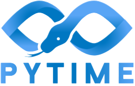
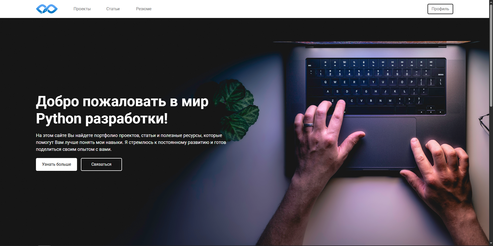
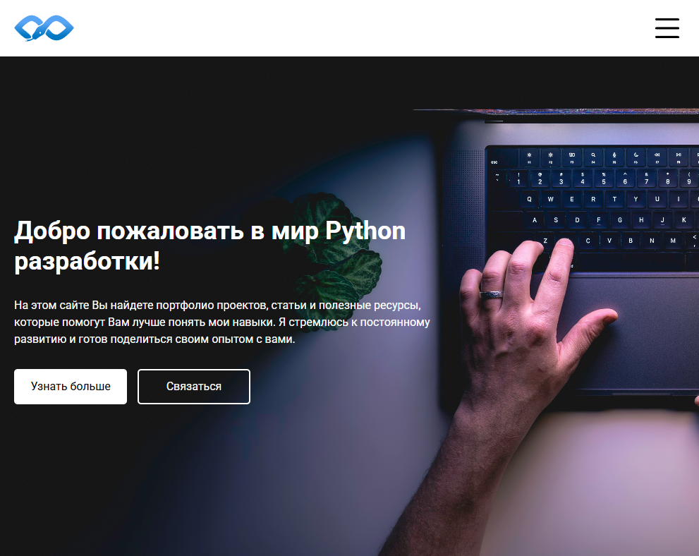
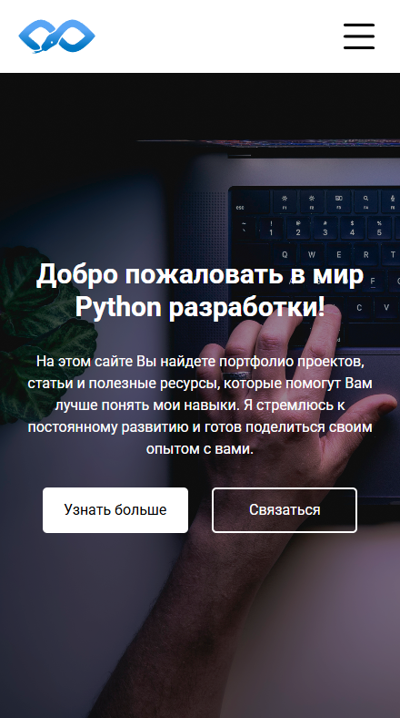
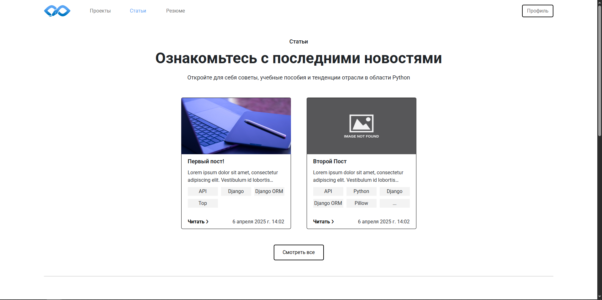
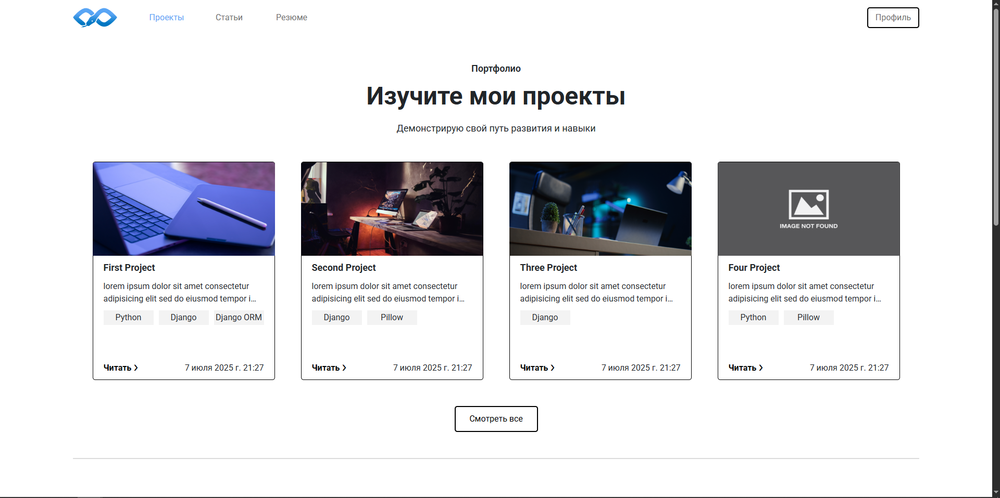
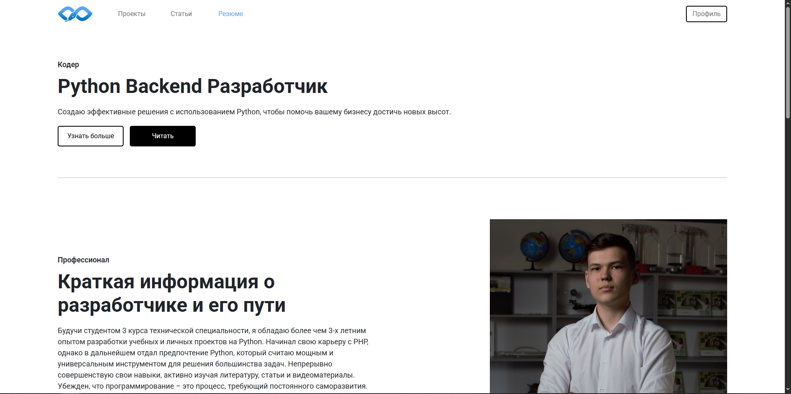

<p align="center">
   
</p>

<h1 align="center">
  PyTime - Сайт разработчика
</h1>

<p align="center" >
  
  
  
  
  
  
</p>

## 🚀 О проекте
**PyTime** – это онлайн-портфолио Python Backend разработчика, созданное для демонстрации навыков и
опыта. Сайт `служит площадкой для размещения ключевой информации, включая проекты, статьи, и 
личного резюме.`

**Основная цель** – презентация квалификации разработчика потенциальным работодателям и 
коллегам, а также хранение и структурирование полезной информации в форме блога и портфолио. 
Здесь Вы найдете примеры кода, описания реализованных проектов и сведения об образовании и опыте
работы.

**PyTime** – это виртуальная визитная карточка, отражающая страсть к разработке и стремление к
постоянному профессиональному росту.

### 🌐 Ссылка на [PyTime.ru - Мой личный сайт на Django](https://www.pytime.ru/)

---

## 📷 Изображения с сайта


<p align="center">
  Адаптивность
</p>

<p align="center">
  
</p>
<p align="center">
  💻 Desktop version
</p>

<br>

<p align="center">
  
</p>
<p align="center">
  📋 Tablet version
</p>

<br>
  
<p align="center">
    
</p>
<p align="center">
  📱 Phone version
</p>

---

<p align="center">
  Другие страницы
</p>

<p align="center">
    
</p>
<p align="center">
  📰 Страница статей
</p>

<br>

<p align="center">
    
</p>
<p align="center">
  📌 Страница проектов
</p>

<br>

<p align="center">
    
</p>
<p align="center">
  📄 Страница с резюме
</p>

---

## 🌍 Доступные URL-адреса
- Главная страница: `pytime.ru/`
- Статьи: `pytime.ru/articles/`
- Проекты: `pytime.ru/projects/`
- Пользовательское соглашение: `pytime.ru/agreement/`
- Политика конфиденциальности: `pytime.ru/privacy/`
- Авторизация: `pytime.ru/login/`
- Регистрация: `pytime.ru/registration/`
- Админ-панель (Для суперпользователя): `pytime.ru/admin/`

---

## 🌟 Особенности
- Персональное портфолио
  - Резюме
  - Описание проектов
  - Статьи
- Система аутентификации
  - Регистрация
  - Авторизации
  - Восстановления пароля
- Адаптивный дизайн для всех устройств
- Админ-панель для управления контентом **(Для суперпользователя)**

---

## 🛠 Технологический стек
### 🔨 Backend
- Python 3.11+
- Django 5.1.7+
- SQLite

### 🎨 Frontend
- HTML5, CSS3, JavaScript
- Bootstrap 5

### 💣 Инфраструктура
- Docker (контейнеризация)
- GitHub Actions (CI/CD)

### 📑 Основные библиотеки
- django-debug-toolbar 5.2.0+
- django-extensions    3.2.3+
- pillow               11.1.0+
- python-dotenv        1.1.0+

---

## 📂 Структура проекта

```
PyTime Site
├── README/                     # README проекта
├── requirements.txt            # Зависимости проекта
├── LICENSE                     # Лицензия
└── PyTime_Project/             # Корневая папка проекта
    ├── PyTime_Project/         # Основные приложения Django
    ├── core/                   # Основное приложение PyTime
    ├── servises_1/             # В разработке...
    ├── ...
    ├── servises_N/             # В разработке...
    ├── templates/              # HTML шаблоны
    ├── uploads/                # Загруженные изображения
    └── manage.py               # Скрипт управления Django
```

---

## 📜 Лицензия
Этот проект распространяется под лицензией `Apache-2.0`. Подробнее см. в файле [LICENSE](LICENSE).

---

## 📧 Контакты
- Автор - Антонов Максим Александрович
- Рабочий Email - karnalize@mail.ru
- PyTime Email - pytime@mail.ru

---

### 🔗 Ссылки
<div align="center">
    <a href="https://github.com/Karnagelized" style="text-decoration:none;">
        
    </a>
    
    <a href="https://t.me/masikantonov" style="text-decoration:none;">
        
    </a>
    
    <a href="https://vk.com/masikantonov" style="text-decoration:none;">
        
    </a>
</div>