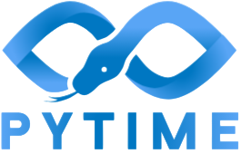
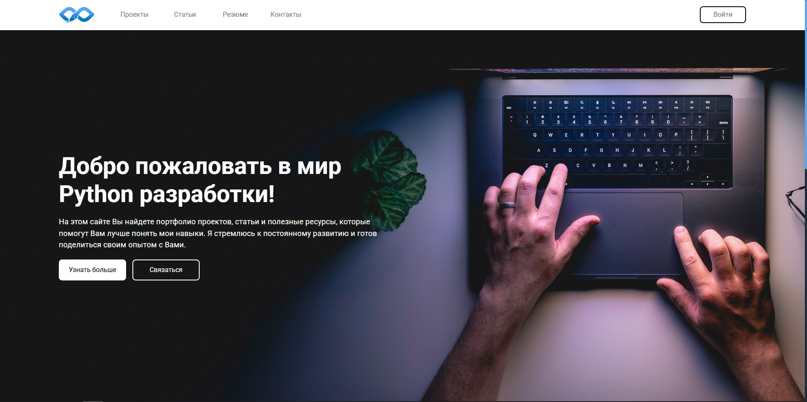
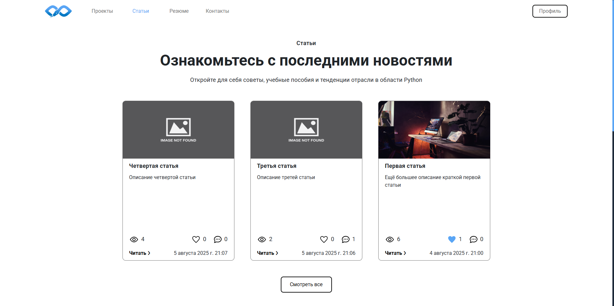
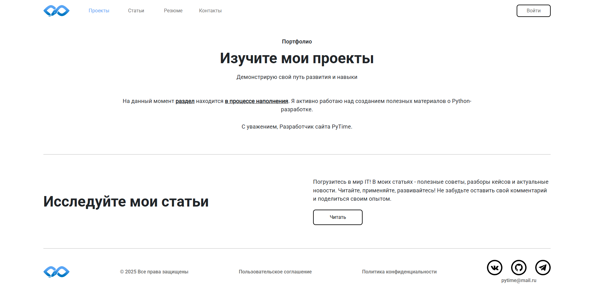
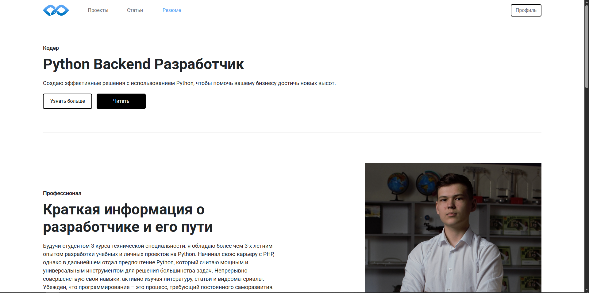
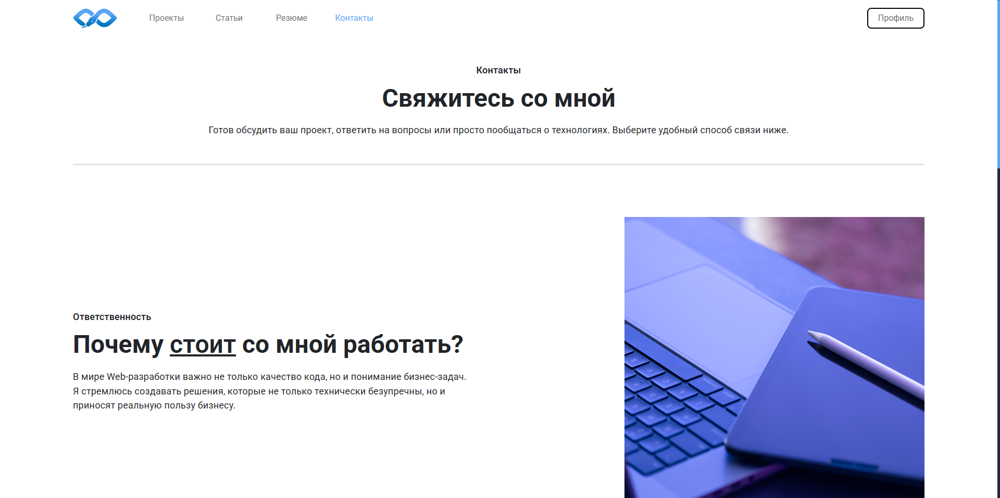
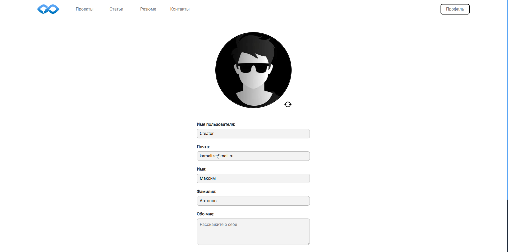
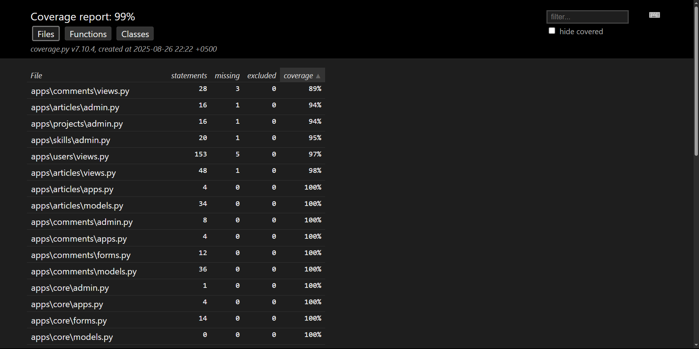
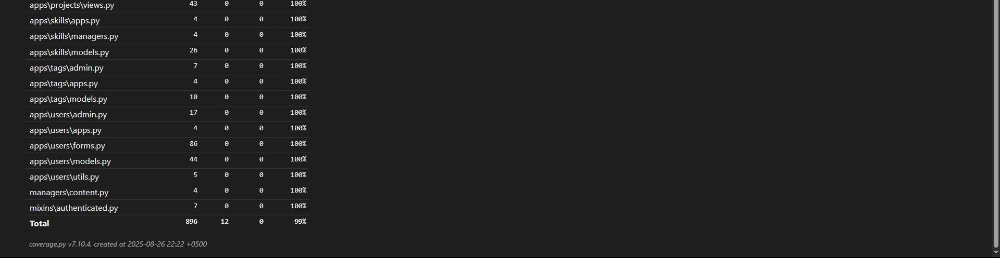

<p align="center">
   
</p>

<h1 align="center">
  PyTime - Сайт разработчика
</h1>

<p align="center" >
  
  
  
  
  
  
  
  
  
</p>

## 🚀 О проекте
**PyTime** – это онлайн-портфолио Python Backend разработчика, созданное для демонстрации навыков и
опыта. Сайт `служит площадкой для размещения ключевой информации, включая проекты, статьи, и 
личного резюме.`

**Основная цель** – презентация квалификации разработчика потенциальным работодателям и 
коллегам, а также хранение и структурирование полезной информации в форме блога и портфолио. 
Здесь вы найдете примеры кода, описания реализованных проектов и сведения об образовании и опыте
работы.

**PyTime** – это виртуальная визитная карточка, отражающая страсть к разработке и стремление к
постоянному профессиональному росту.

### 🌐 Ссылка на [PyTime.ru - Начало Backend разработчика на Python](https://www.pytime.ru/)

---

## 📷 Изображения с сайта

<p align="center">
  
</p>
<p align="center">
  💻 Главная страница
</p>

<br>

<p align="center">
    
</p>
<p align="center">
  📰 Страница статей
</p>

<br>

<p align="center">
    
</p>
<p align="center">
  📌 Страница проектов
</p>

<br>

<p align="center">
    
</p>
<p align="center">
  📄 Страница резюме
</p>

<br>

<p align="center">
    
</p>
<p align="center">
  📄 Страница контактов
</p>

<br>

<p align="center">
    
</p>
<p align="center">
  📄 Профиль Пользователя
</p>

---

## 🌍 Доступные URL-адреса
- Главная страница: `pytime.ru/`
- Статьи: `pytime.ru/articles/`
- Все статьи: `pytime.ru/all-articles/`
- Проекты: `pytime.ru/projects/`
- Все проекты: `pytime.ru/all-projects/`
- Контакты: `pytime.ru/contact/`
- Сервисы: `pytime.ru/services/` (В разработке)
- Пользовательское соглашение: `pytime.ru/agreement/`
- Политика конфиденциальности: `pytime.ru/privacy/`
- Авторизация: `pytime.ru/login/`
- Регистрация: `pytime.ru/registration/`
- Админ-панель (Для суперпользователя): `pytime.ru/admin/`

---

## 🌟 Особенности
- Персональное портфолио
  - Резюме
  - Описание проектов
  - Статьи
  - Контакты
  - Сервисы (В разработке)
- Система аутентификации
  - Регистрация
  - Авторизации
  - Восстановления пароля (В разработке)
- Адаптивный дизайн для всех устройств
- Админ-панель для управления контентом **(Для суперпользователя)**

---

## 🛠 Технологический стек
### 🔨 Backend
- Python 3.11+
- Django 5.1.7+
- PostgreSQL (psycopg2)

### 🎨 Frontend
- Bootstrap 5
- HTML5, CSS3, JavaScript

### 💣 Инфраструктура
- Docker (контейнеризация)
- GitHub Actions (CI/CD)

### 📑 Основные библиотеки
- gunicorn 23.0.0+
- psycopg2 2.9.10+
- django-extensions 3.2.3+
- django-environ 0.12.0+
- django-ckeditor 6.7.3+
- django-recaptcha 4.1.0+
- django-bleach 3.1.0+
- bleach 5.0.1+
- factory_boy 3.3.3+
- pillow 11.1.0+
- numpy 2.3.1+
- better-profanity 0.7.0+ 
- coverage==7.10.4

---

## 📊 Тестирование

Для тестирования использовалась технология `UnitTest`, а для отслеживания 
покрытия кода тестами применялась библиотека `coverage`. В проекте достигнуто 
`99% покрытия тестами`, что обеспечивает высокую надежность и стабильность 
работы приложения. Тесты охватывают все основные модули, включая 
пользовательскую аутентификацию, работу с статьями и проектами, систему 
комментариев и функционал электронной почты.

<p align="center">
  
  
</p>
<p align="center">
  📈 Результаты покрытия тестами проекта
</p>


## 📂 Структура проекта

```
PyTime Site
├── LICENSE               # Лицензия
├── docker-compose.yml    # Контеризация приложения
├── README.md
├── .gitattributes
├── .gitignore
├── README/               # Файлы для README.md
├── conf/                 # Nginx конфиг
├── dev_database/         # Контеризация тестовой БД
└── PyTime_Project/       # Корневая папка проекта
    ├── PyTime_Project/   # Основные файлы Django приложения
    ├── apps/             # Директрория приложений
    │   ├── core/
    │   ├── users/
    │   ├── articles/
    │   ├── projects/
    │   ├── tags/
    │   ├── comments/
    │   ├── skills/
    │   ├── mail/
    │   └── likes/
    ├── servises/         # Директрория сервисов (В разработке)
    │   ├── servises_1/
    │   ├── ...
    │   └── servises_N/
    ├── .coveragerc           # Настройки coverage
    ├── .dockerignore
    ├── Dockerfile            # Docker файл приложения
    ├── requirements.prod.txt # Библиотеки для продакшена
    ├── requirements.txt      # Библиотеки для разработки
    ├── managers/             # Менеджеры приложений
    ├── mixins/               # Миксины приложений
    ├── templates/            # HTML шаблоны
    └── manage.py             # Скрипт управления Django
```

---

## 📜 Лицензия
Этот проект распространяется под лицензией `Apache-2.0`. Подробнее см. в файле [LICENSE](LICENSE).

---

## 📧 Контакты
- Автор - Антонов Максим Александрович
- Рабочий Email - karnalize@mail.ru
- PyTime Email - pytime@mail.ru

---

### 🔗 Ссылки
<div align="center" style="display: flex; justify-content: space-evenly">
    <a href="https://t.me/masikantonov" style="text-decoration:none;">
        
    </a>
    <a href="https://vk.com/masikantonov" style="text-decoration:none;">
        
    </a>
    <a href="https://pytime.ru" style="text-decoration:none;">
        
    </a>
</div>